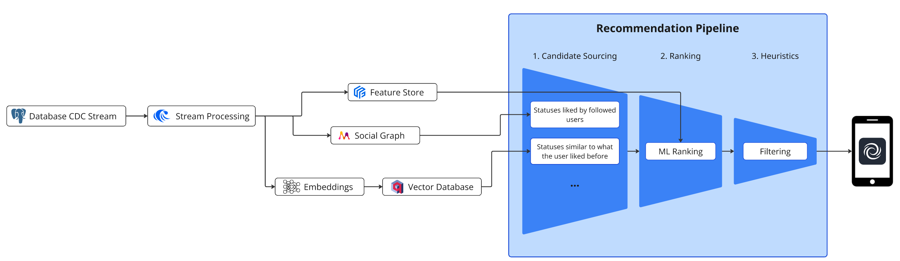

<p align="center">
    
</p>

# About Fediway

Fediway solves content discovery on Mastodon with the first advanced server-side recommendation pipeline. Fediway is a server-side plugin for Mastodon that can be integrated into an existing Mastodon instance without requiring a custom fork or modifications to the core codebase. You can simply redirecting desired endpoints such as `timelines/home` via nginx to the fediway API.

> **NOTE:** This project is currently a work in progress and may be in an unstable state. Features may be incomplete or subject to change. Use with caution.

## Table Of Contents

- [Why do we need algorithmic feeds?](#why)
- [Why server-side?](#server-side)
- [The Algorithm](#how_it_works)
  - [Architecture](#architecture)
  - [Recommendation Engine](#engine)
- [Alternatives](#alternatives)
- [Setup](#setup)

<a name="why"></a>

## Why do we need algorithmic feeds?

> "... see it all in chronological order. **No algorithms**, ads, or clickbait in sight."

This is how Mastodon advertises its platform on their frontpage and it sounds great right? Back to the good old times of chronological timelines. And it is great ... but only for a niche audience, many of whom already use the platform. The decision of abandoning recommendations comes at a cost. New users face empty feeds and must actively search for content they like. 

Without efficient content-distribution, the "trending" page becomes dominated by mainstream content, while niche creators struggle to reach their audience. This creates a significant barrier that prevents Mastodon from becoming a true alternative to centralized platforms. 

To become a true alternative, decentralized platforms need a robust solution for content discovery that doesn't compromise their core values. Fediway implements the tool that makes this possible: An open-source framework that let's you to design, test and implement your own recommendation algorithms for your Mastodon instance. Join us to build algorithms that serve people. Let's make the Fediverse attractable to anyone!

<a name="server-side"></a>

## Why server-side?

Many alternatives are implementing algorithmic feeds for Mastodon as client-side tools. However client-side solutions have significant limitations for distributing content to the right audience. They bring complexity to users that are not familiar with the working of decentralized social networks. Users have to action on their own to be able to use them. For example: create an API-Key, install a browser extension or install a desktop app.

The complexity of the fediverse is a significant problem that limits user growth, attracting mostly technical users. Making the Fediverse accessible to everyone requires solutions that hide complexity from the user. Server-side recommendations shift this complexity from the user to the platform itself. Furthermore, server-side recommendations enable more advanced recommendation logic that improves content discovery and can increase the likelihood of new visitors registering to an instance.

<a name="how_it_works"></a>

## How it works?

The algorithm follows of a multi-stage pipeline that consists of the following main stages:

1. **Candidate Sourcing**: ~1000 Posts are fetched from various sources which aim to preselect the best candidates from recent posts.
2. **Ranking**: The candidates are ranked by a machine learning model that estimates the likelihood of user interaction with each candidate.
3. **Sampling**: In the final stage, heuristics are applied to diversify recommendations which are sampled depending on the engagement scores estimated in the ranking step.

<a name="architecture"></a>

### Architecture



<a name="engine"></a>

### Recommendation Engine

Fediway includes a recommendation engine that makes it easy to build custom recommendation pipelines:

```py
from modules.fediway.feed import Feed
from modules.fediway.feed.sampling import TopKSampler
from modules.fediway.rankers import SimpleStatsRanker
from modules.fediway.sources.statuses import (
    MostInteractedByMutualFollowsSource,
    CommunityBasedRecommendationsSource,
)

pipeline = (
    Feed()
    .select('status_id')
    .source(MostInteractedByMutualFollowsSource(account_id), 100)
    .source(CommunityBasedRecommendationsSource(account_id, language='en'), 100)
    .rank(SimpleStatsRanker())
    .diversify(by='status:account_id', penalty=0.1)
    .sample(20, sampler=TopKSampler())
    .paginate(20, offset=0)
)

recommendations = pipeline.execute()

for r in recommendations:
    print(r.id, r.score)
```


<a name="alternatives"></a>

## Alternatives

| Project | Server/Client-Side | Last Activity | Description |
| --- | --- | --- | --- |
| Fediway | Server-Side |  | Advanced recommendation framework that can be installed into an existing mastodon server. |
| [BYOTA](https://github.com/mozilla-ai/byota) | Client-Side |  | Mozilla’s research project for user-controlled timeline ranking. |
| [fediview](https://github.com/adamghill/fediview) | Client-Side |  | Web-based client that provides a digest of popular posts and boosts from your Mastodon timeline. |
| [fedialgo](https://github.com/pkreissel/fedialgo) | Client-Side |  | Local mastodon client, that reorders your chronological timeline, with customization options. |
| [Mastodon Digest](https://github.com/hodgesmr/mastodon_digest) | Client-Side |  | Generates a digest of popular posts from your Mastodon timeline, with customizable scoring algorithms and themes. |
| [Fedi-Feed](https://github.com/pkreissel/fedifeed) | Client-Side |  | Web-based client that displays Mastodon posts in a curated feed with a user-customizable algorithm. |

<a name="setup"></a>

## Setup

Fediway requires the following services:

- [RisingWave](https://risingwave.com/) - Streaming database serving real time features for ML inference
- [Apache Kafka](https://kafka.apache.org/) - Message broker for ingesting data into memgraph, serving real time features and more
- [Memgraph](https://memgraph.com/) - In memory graph database for candidate sourcing
- [Qdrant](https://qdrant.tech/) - Vector database for content based candidate sourcing

<details>

<summary>docker-compose.yaml for local development</summary>

```sh
version: '3.8'

services:
  memgraph:
    image: memgraph/memgraph-mage:3.1.1-memgraph-3.1.1
    ports:
      - "7687:7687"

  qdrant:
    image: qdrant/qdrant:latest
    ports:
      - "6333:6333" # HTTP API
      - "6334:6334" # gRPC API
    healthcheck:
      test: ["CMD", "curl", "--fail", "http://localhost:6333/health"]
      interval: 30s
      timeout: 10s
      retries: 3

  postgres:
    image: postgres:16
    shm_size: 256mb
    environment:
      - POSTGRES_USER=mastodon
      - POSTGRES_PASSWORD=password
      - POSTGRES_DB=mastodon_development
    command: 
      - "postgres"
      - "-c"
      - "wal_level=logical"
    volumes:
      - ./data/postgres16:/var/lib/postgresql/data
    ports:
      - "5432:5432"
    networks:
      - app_network
    healthcheck:
      test: ["CMD-SHELL", "pg_isready -U mastodon -d mastodon_development"]
      interval: 5s
      timeout: 5s
      retries: 5

  zookeeper:
    image: confluentinc/cp-zookeeper:latest
    environment:
      ZOOKEEPER_CLIENT_PORT: 2181
    networks:
      - app_network

  kafka:
    image: confluentinc/cp-kafka:latest
    depends_on:
      - zookeeper
    environment:
      KAFKA_BROKER_ID: 1
      KAFKA_OFFSETS_TOPIC_REPLICATION_FACTOR: 1
      KAFKA_ZOOKEEPER_CONNECT: zookeeper:2181
      KAFKA_ADVERTISED_LISTENERS: PLAINTEXT://kafka:9092,PLAINTEXT_HOST://localhost:29092
      KAFKA_LISTENER_SECURITY_PROTOCOL_MAP: PLAINTEXT:PLAINTEXT,PLAINTEXT_HOST:PLAINTEXT
    ports:
      - "9092:9092"
      - "29092:29092"
    networks:
      - app_network

  risingwave:
    image: risingwavelabs/risingwave:latest
    depends_on:
      postgres:
        condition: service_healthy
    ports:
      - "4566:4566"
      - "5691:5691"
    networks:
      - app_network
    healthcheck:
      test: ["CMD", "curl", "-f", "http://localhost:5691/metrics"]
      interval: 5s
      timeout: 5s
      retries: 5

networks:
  app_network:
    driver: bridge
```

</details>

1. Create a new postgres user with CDC privileges.

```sql
-- psql -U postgres

-- Grand CDC privileges
CREATE USER risingwave REPLICATION LOGIN CREATEDB;
ALTER USER risingwave WITH PASSWORD 'password';
GRANT CONNECT ON DATABASE mastodon_development TO risingwave;
GRANT USAGE ON SCHEMA public TO risingwave;
GRANT SELECT ON ALL TABLES IN SCHEMA public TO risingwave;
GRANT CREATE ON DATABASE mastodon_development TO risingwave;
CREATE PUBLICATION risingwave FOR ALL TABLES;
```

2. Setup

```sh
sh bin/setup
```

3. Run services

```sh
# Run fastapi server
uvicorn apps.api.main:app --reload

# Run Kafka stream consumer
faststream run apps.streaming.main:app

# Run Celery worker for repeating tasks
celery -A apps.worker.main worker --loglevel=info --queues=schwarm,sources

# Run Celery beat scheduler
celery -A apps.worker.main:app beat --loglevel=info
```

### Configuration

<details>

<summary>Store feast registry on s3</summary>

```sh
# 1. add variable to .env file
FEAST_REGISTRY=s3://my-bucket/registry.db

# 2. export the following variables
export FEAST_S3_ENDPOINT_URL="https://fsn1.your-objectstorage.com"
export AWS_ACCESS_KEY_ID="YOUR_S3_ACCESS_KEY"
export AWS_SECRET_ACCESS_KEY="YOUR_S3_SECRET_KEY"

# 3. apply
python feedctl feast apply
```

</details>
