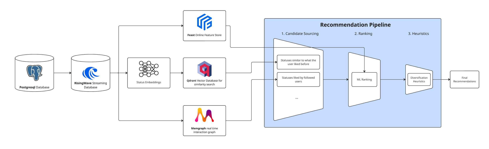

<p align="center">
    
</p>

# About Fediway

Fediway brings algorithmic feeds to Mastodon in an attempt to make decentralised social media more attractive to new users. Fediway feeds can be integrated into an existing mastodon instance without requiring a custom fork or modifications to the core codebase. You can simply redirecting desired endpoints such as `timelines/home` via nginx to the fediway API.

> **NOTE:** This project is currently a work in progress and is in an unstable state. Features may be incomplete or subject to change. Use with caution.

## Table Of Contents

- [Why do we need algorithmic feeds?](#why)
- [Architecture](#architecture)
- [The Algorithm](#how_it_works)
    - [Recommendation Engine](#engine)
    - [Candidate Sources](#sources)
- [Setup](#setup)

<a name="architecture"></a>

## Why do we need algorithmic feeds?

> "... see it all in chronological order. No algorithms, ads, or clickbait in sight."

This is how Mastodon advertises its platform on the frontpage and it sounds great right? Back to the good old times of chronological timelines without any filter bubbles. And it is great for a key niche audience, many of whom already use the platform. But the decision of abandoning recommendations comes at a cost. New users face empty feeds and must actively search for content they like. Ultimately, only those users whose interest in using Mastodon as advertised outweighs the initial challenge of finding their way around, will stay. 

The only discovery feed is the "trending" page, which favors posts with more recent engagements. This leads to mainstream bias often dominated by US politics, which ultimately contradicts the diversity goals of the Fediverse. For authors of niche content (e.g.: a small pottery or a Café), it is much harder to build an audience and reach potential customers on Mastodon than on popular centralized platforms as there is no system precisely distributing their content to the right audience. With social media being the most important marketing channel for many businesses, this marks a serious issue that leads to many not considering Mastodon as a viable alternative.

Most importantly, Algorithms that decide what content is seen already have a significant impact on our society. They influence what we buy, what we like and what news we consume. As a society we have a great interest in ensuring these algorithms are fair. Most popular centralized platforms keep the inner workings of their algorithms a secret. However, observational studies indicate a strong bias that often aligns with the political agendas of their owners. The lack of transparency poses a significant threat to society, as it conceals potential misuse from the public. Additionally, most algorithms are designed to maximize scroll time and engagement to increase ad exposure and profits. This creates addictive patterns by triggering frequent dopamine releases, which has proven especially harmful to young users. There is an urgent need for public discourse on how they should work, how to ensure fairness, and how mitigating potential harm to users. Rather than abandoning recommendation algorithms completely, Fediway open-sources them, allowing a debate and community participation in reaching these goals while also distributing content precisely to the right audience.

<a name="architecture"></a>

## Architecture



<a name="how_it_works"></a>

## How it works?

The algorithm follows of a multi-stage pipeline that consists of the following main stages:

1. **Candidate Sourcing**: ~1000 Posts are fetched from various sources which aim to preselect the best candidates from recent posts.
2. **Ranking**: The candidates are ranked by a machine learning model that estimates the likelihood of user interaction with each candidate.
3. **Sampling**: In the final stage, heuristics are applied to diversify recommendations which are sampled depending on the engagement scores estimated in the ranking step.

<a name="engine"></a>

### Recommendation Engine

Fediway includes a recommendation engine that makes it easy to build custom recommendation pipelines:

```py
from modules.fediway.feed import Feed
from modules.fediway.feed.sampling import TopKSampler
from modules.fediway.rankers import SimpleStatsRanker
from modules.fediway.sources.statuses import (
    MostInteractedByMutualFollowsSource,
    CommunityBasedRecommendationsSource,
)

pipeline = (
    Feed()
    .select('status_id')
    .source(MostInteractedByMutualFollowsSource(account_id), 100)
    .source(CommunityBasedRecommendationsSource(account_id, language='en'), 100)
    .rank(SimpleStatsRanker())
    .diversify(by='status:account_id', penalty=0.1)
    .sample(20, sampler=TopKSampler())
    .paginate(20, offset=0)
)

recommendations = pipeline.execute()

for r in recommendations:
    print(r.id, r.score)
```

<a name="sources"></a>

### Candidate Sources

Narrowing down the vast pool consiting of up to billions of potential posts to recommend is a critical step in finding posts that are potentially relevant to the user.

<a name="setup"></a>

## Setup

Fediway requires the following services:

- [RisingWave](https://risingwave.com/) - Streaming database serving real time features for ML inference
- [Apache Kafka](https://kafka.apache.org/) - Message broker for ingesting data into memgraph, serving real time features and more
- [Memgraph](https://memgraph.com/) - In memory graph database for candidate sourcing
- [Qdrant](https://qdrant.tech/) - Vector database for content based candidate sourcing

<details>

<summary>docker-compose.yaml for local development</summary>

```sh
version: '3.8'

services:
  memgraph:
    image: memgraph/memgraph-mage:3.1.1-memgraph-3.1.1
    ports:
      - "7687:7687"

  qdrant:
    image: qdrant/qdrant:latest
    ports:
      - "6333:6333" # HTTP API
      - "6334:6334" # gRPC API
    healthcheck:
      test: ["CMD", "curl", "--fail", "http://localhost:6333/health"]
      interval: 30s
      timeout: 10s
      retries: 3

  postgres:
    image: postgres:16
    shm_size: 256mb
    environment:
      - POSTGRES_USER=mastodon
      - POSTGRES_PASSWORD=password
      - POSTGRES_DB=mastodon_development
    command: 
      - "postgres"
      - "-c"
      - "wal_level=logical"
    volumes:
      - ./../postgres16:/var/lib/postgresql/data
    ports:
      - "5432:5432"
    networks:
      - app_network
    healthcheck:
      test: ["CMD-SHELL", "pg_isready -U mastodon -d mastodon_development"]
      interval: 5s
      timeout: 5s
      retries: 5

  zookeeper:
    image: confluentinc/cp-zookeeper:latest
    environment:
      ZOOKEEPER_CLIENT_PORT: 2181
    networks:
      - app_network

  kafka:
    image: confluentinc/cp-kafka:latest
    depends_on:
      - zookeeper
    environment:
      KAFKA_BROKER_ID: 1
      KAFKA_OFFSETS_TOPIC_REPLICATION_FACTOR: 1
      KAFKA_ZOOKEEPER_CONNECT: zookeeper:2181
      KAFKA_ADVERTISED_LISTENERS: PLAINTEXT://kafka:9092,PLAINTEXT_HOST://localhost:29092
      KAFKA_LISTENER_SECURITY_PROTOCOL_MAP: PLAINTEXT:PLAINTEXT,PLAINTEXT_HOST:PLAINTEXT
    ports:
      - "9092:9092"
      - "29092:29092"
    networks:
      - app_network

  risingwave:
    image: risingwavelabs/risingwave:latest
    depends_on:
      postgres:
        condition: service_healthy
    ports:
      - "4566:4566"
      - "5691:5691"
    networks:
      - app_network
    healthcheck:
      test: ["CMD", "curl", "-f", "http://localhost:5691/metrics"]
      interval: 5s
      timeout: 5s
      retries: 5

networks:
  app_network:
    driver: bridge
```

</details>

1. Create a new postgres user with CDC privileges.

```sql
-- psql -U postgres

-- Grand CDC privileges
CREATE USER risingwave REPLICATION LOGIN CREATEDB;
ALTER USER risingwave WITH PASSWORD 'password';
GRANT CONNECT ON DATABASE mastodon_development TO risingwave;
GRANT USAGE ON SCHEMA public TO risingwave;
GRANT SELECT ON ALL TABLES IN SCHEMA public TO risingwave;
GRANT CREATE ON DATABASE mastodon_development TO risingwave;
```

2. Setup

```sh
sh bin/setup
```

3. Run services

```sh
# Run fastapi server
uvicorn apps.api.main:app --reload

# Run Kafka stream consumer
faststream run apps.streaming.main:app

# Run Celery worker for repeating tasks
celery -A apps.worker.main worker --loglevel=info --queues=schwarm,sources

# Run Celery beat scheduler
celery -A apps.worker.main:app beat --loglevel=info
```

### Configuration

<details>

<summary>Store feast registry on s3</summary>

```sh
# 1. add variable to .env file
FEAST_REGISTRY=s3://my-bucket/registry.db

# 2. export the following variables
export FEAST_S3_ENDPOINT_URL="https://fsn1.your-objectstorage.com"
export AWS_ACCESS_KEY_ID="YOUR_S3_ACCESS_KEY"
export AWS_SECRET_ACCESS_KEY="YOUR_S3_SECRET_KEY"

# 3. apply
python feedctl feast apply
```

</details>
